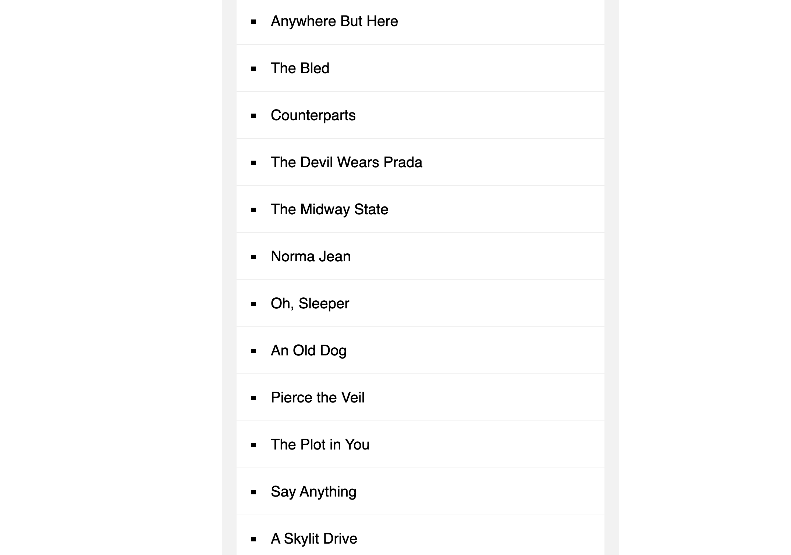

# sort_without_articles

This is a 30-days javascript grinding  
js30 [https://github.com/ningh98/js30]  
17. Sort without articles [https://github.com/ningh98/sort_without_articles]

## Table of contents

- [Overview](#overview)
  - [Screenshot](#screenshot)
  - [Links](#links)
- [My process](#my-process)
  - [Built with](#built-with)
  - [What I learned](#what-i-learned)


## Overview

This HTML, CSS, and JavaScript code demonstrates how to create a sorted list of band names, ignoring common articles ("a", "an", "the") at the beginning of the names. The sorted list is then displayed on a web page with a styled background and list elements.

### Screenshot




### Links

- Live Site URL: [https://ningh98.github.io/sort_without_articles/]

## My process

### Built with

- HTML
- CSS
- Javascript


### What I learned


```js

const bands = ['The Plot in You', 'The Devil Wears Prada', 'Pierce the Veil', 'Norma Jean', 'The Bled', 'Say Anything', 'The Midway State', 'We Came as Romans', 'Counterparts', 'Oh, Sleeper', 'A Skylit Drive', 'Anywhere But Here', 'An Old Dog'];

function strip(bandName){
  return bandName.replace(/^(a |the |an )/i, '').trim()
}

const sortedBands = bands.sort((a, b) => strip(a) > strip(b) ? 1 : -1)

document.querySelector('#bands').innerHTML = 
  sortedBands
    .map(band => `<li>${band}</li>`)
    .join('')


console.log(sortedBands)
```
